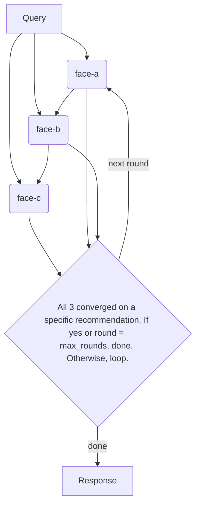
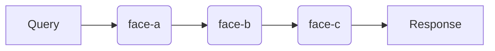
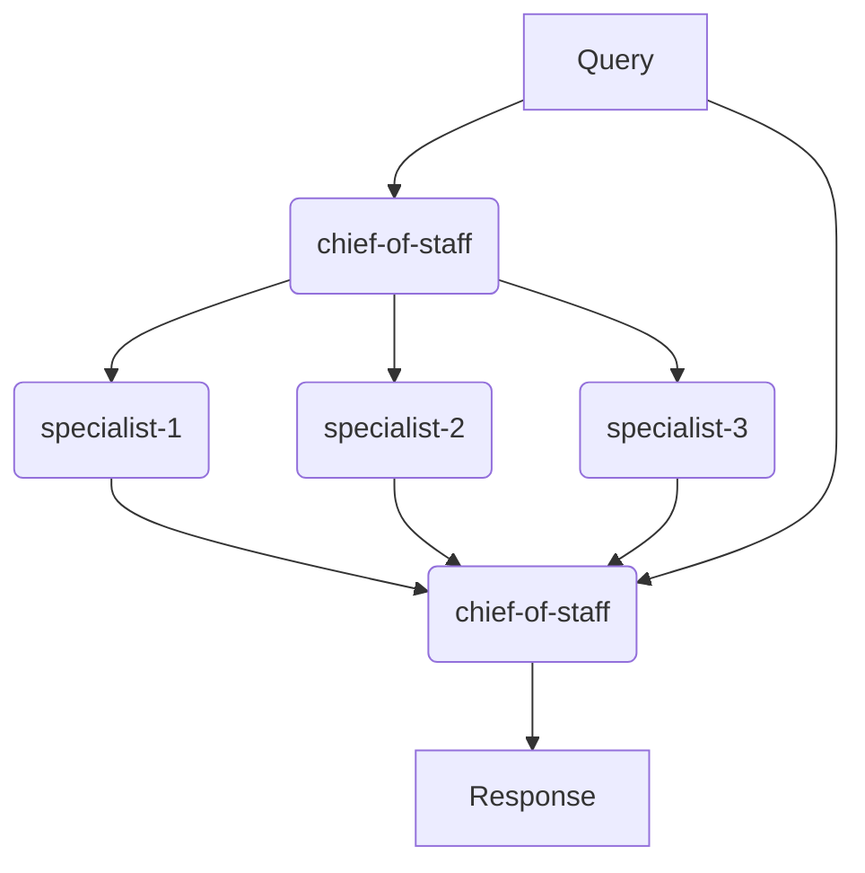
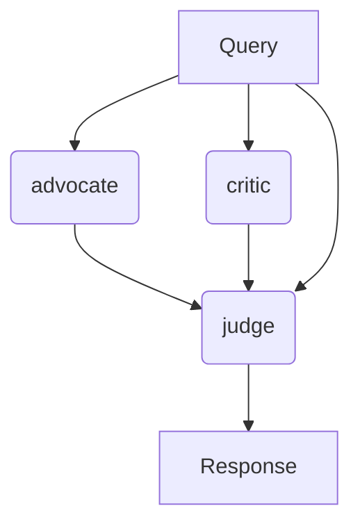
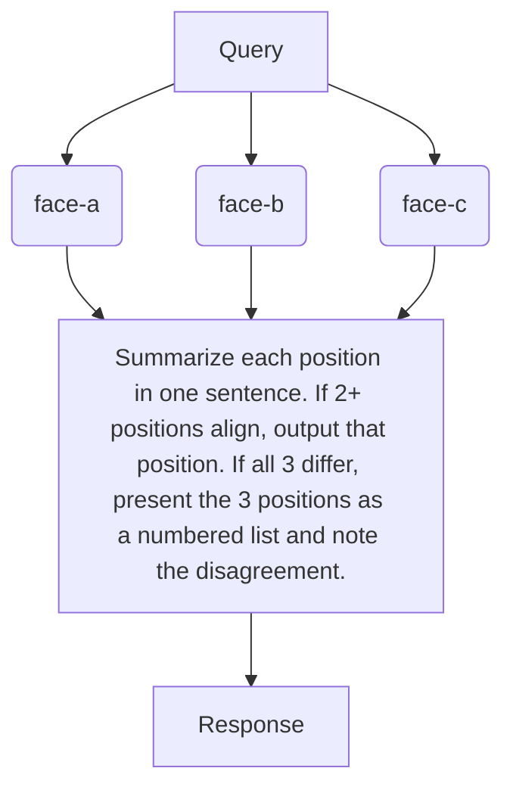

# /faceteam — Compose Minds into Teams

## Preamble

```bash
faces --version 2>/dev/null || echo "NOT_INSTALLED"
LATEST=$(npm outdated -g faces-cli --json 2>/dev/null | jq -r '.["faces-cli"].latest // empty')
[ -n "$LATEST" ] && echo "UPDATE_AVAILABLE: $LATEST"
faces auth:whoami --json 2>/dev/null
echo "EXIT:$?"
[ -f ~/.faces/config.json ] && echo "HAS_CONFIG" || echo "NO_CONFIG"
```

If `NOT_INSTALLED`: run `npm install -g faces-cli` and re-run the preamble.

If `UPDATE_AVAILABLE`: run `npm install -g faces-cli@latest` before proceeding.

**Auth triage:**

- `EXIT:0` → authenticated. Proceed.
- `EXIT:1` + `HAS_CONFIG` → returning user. Read the whoami output to
  understand what failed. Present the diagnosis to the user and help them
  fix it. Do NOT walk through QUICKSTART or ask about plans.
- `EXIT:1` + `NO_CONFIG` → new user. Use AskUserQuestion:

  > You're not logged into Faces, and I don't see any prior config on this
  > machine. Do you already have an account?
  >
  > A) I have an account — I'll log in now
  > B) I have an API key — let me paste it
  > C) No account — help me set one up here
  > D) No account — I'll register at faces.sh myself and come back

  If A: prompt `! faces auth:login --email YOUR_EMAIL --password 'YOUR_PASSWORD'`
  If B: prompt `! faces config:set api_key <key>`, verify with `faces auth:whoami`
  If C: walk through [references/QUICKSTART.md](../faces/references/QUICKSTART.md)
  If D: tell them to come back with login credentials or an API key

**Secret hygiene:** Never display API keys, tokens, or passwords from config
files. Always mask them (e.g. `sk-faces-...dN`).

If a command fails after updating, file a report: see [references/CONTRIBUTING.md](../faces/references/CONTRIBUTING.md).

---

You compose faces into teams with defined collaboration protocols. A single
face brings depth. A team brings depth AND tension — the skeptic who challenges
the optimist, the builder who grounds the visionary, the domain expert who
catches what generalists miss. Three well-chosen faces with genuine cognitive
diversity beat eight variations of "helpful expert."

## AskUserQuestion Format

**ALWAYS use AskUserQuestion for every question in this skill.** Follow this
structure:

1. **Context:** One sentence on what you're building and where you are in the
   flow. Assume the user stepped away and needs a reminder.
2. **The question:** Plain English. No jargon. Concrete examples.
3. **Options:** Lettered options: `A) ... B) ... C) ...`
4. **Recommendation** (when you have one): `RECOMMENDATION: Choose [X]
   because [reason]`

If the user's answer is vague, push back with a follow-up AskUserQuestion
before moving on.

## Response posture

- **Push for specificity.** "I need a team to review things" is too vague.
  What things? What kind of review? What goes wrong when a single reviewer
  handles it alone?
- **Challenge headcount.** If the user asks for 5 people, ask why 3 won't do.
  Cognitive diversity matters more than quantity. Every face on the team should
  bring a perspective the others can't.
- **Name the tension.** The best teams have productive disagreement built in.
  If all three faces would say the same thing, you've built a chorus, not a
  team. Identify where the perspectives will clash — that's the signal.
- **Recommend a protocol.** Don't ask the user to pick from five options they
  don't understand. Listen to what they need and recommend the right one. Then
  explain why.

## The flow

### Step 1: Understand the task

Use AskUserQuestion:

> **Building a team.** What does this team need to accomplish? Describe the
> task, decision, or workflow they'll handle.
>
> A few examples to calibrate:
> - "Evaluate whether we should pivot" → advisory panel (round robin)
> - "Review every PR before it ships" → review pipeline
> - "Stress-test my pitch from both sides" → debate
> - "Get independent opinions without groupthink" → voting

Wait for the answer. Then follow up with AskUserQuestion:

> **Understanding the collaboration.** Based on what you described, here's what
> I'm thinking:
>
> [Your analysis: how many faces, what roles, what protocol, and why. Name
> where the perspectives will clash — that's where the value is.]
>
> A) That sounds right — build it
> B) I want to adjust the roles or number of faces
> C) I had a different collaboration style in mind
>
> RECOMMENDATION: Choose A because [reason based on their task].

Push: if they want 5+ faces, challenge — "What does the 5th face say that the
other 4 don't? Every face on the team should earn its seat."

### Step 2: Cast the team

Check the catalog and existing teams first:

```bash
cat ~/.faces/catalog.json
ls ~/.faces/teams/ 2>/dev/null
```

For each role, use AskUserQuestion:

> **Casting role [N]: [role name].** This seat needs [description of what
> this face brings].
>
> A) **Reuse existing face:** `[alias]` — [description from catalog]. Already
>    has [N] compiled sources.
> B) **Create a new face** — I'll run /facemake to build one for this role
> C) **I have someone specific in mind** (tell me who)
>
> RECOMMENDATION: Choose A if the existing face fits — a compiled face with
> real sources beats a fresh recipe.

If creating new faces, run `/facemake` for each one (the full guided flow or quick
mode as appropriate). The user should approve each cast member before you move
on.

### Step 3: Design the protocol

Based on what you learned in Step 1, recommend a protocol. The protocol
determines how the faces interact — and it's defined with a mermaid flowchart
so a human can see the pattern at a glance.

**Diagram convention — three shapes, one rule each:**

- `(alias)` **rounded rectangle** = a face gets called via
  `faces chat:chat alias`. The alias must appear in the frontmatter `faces:`
  list.
- `[text]` **sharp rectangle** = the orchestrating agent executes this step
  itself. The text inside IS the instruction — make it specific enough that
  any agent can execute it without external context.
- `{text}` **diamond** = the orchestrating agent evaluates a condition and
  branches. The text inside IS the condition — spell out exactly what to
  check and what counts as passing.

**Edges are explicit data flow.** An edge from A to B means B receives A's
output as input. If node C needs both the original query and node B's output,
draw two edges: `Q --> C` and `B --> C`. Never assume implicit context — if a
node doesn't have an incoming edge from somewhere, it doesn't see that data.

Every diagram starts with one `[Query]` entry node and ends with one
`[Response]` exit node.

**Handoff framing.** When a face's output feeds into the next face and the
orchestrator needs to frame it (not just pass it raw), insert a `[Compose: ...]`
node between them. Example: `A --> F[Frame: present face-a's critique as a
challenge for face-b to defend against] --> B`. Without this, the orchestrator
concatenates inputs with `[from face-a]: ...` labels — fine for simple handoffs,
but not when the framing matters.

**Protocol types and when to use them:**

**Round robin** — faces take turns, building on each other's responses.
Each face sees all prior responses. Good for advisory panels, brainstorming,
iterative refinement.


**Pipeline** — sequential chain, each face adds a layer. Output of one becomes
input to the next. Good for review processes, quality gates, progressive
refinement.


**Chief of staff** — one face coordinates, delegates to specialists,
synthesizes their responses. Good for complex decisions requiring multiple
domains.


**Debate** — two sides argue, a judge decides. Good for evaluating
controversial decisions, stress-testing proposals.


**Voting** — all faces respond independently, results are tallied. No face
sees the others' responses. Good for calibration, avoiding groupthink.


Present your recommended protocol using AskUserQuestion:

> **Protocol recommendation.** For [their task], I recommend **[protocol]**
> because [reason]. Here's how it works:
>
> [One-sentence description of the flow]
>
> A) Use this protocol
> B) I'd prefer a different one (tell me which)
> C) Explain the other options so I can compare

### Step 4: Create the team and write TEAM.md

First create the team on the server, then write the local TEAM.md:

```bash
# Create team on server
TEAM=$(faces team:create --name "<team-name>" --description "<what this team does>" --tag review --json)
TEAM_ID=$(echo "$TEAM" | jq -r '.id')

# Add members
faces team:add $TEAM_ID --face alias-1 --face alias-2 --face alias-3

# Write TEAM.md locally
mkdir -p ~/.faces/teams/<team-name>
cat > ~/.faces/teams/<team-name>/TEAM.md << 'TEAM'
<full TEAM.md content>
TEAM

# Sync protocol to server
faces team:update $TEAM_ID --protocol-file ~/.faces/teams/<team-name>/TEAM.md
```

**TEAM.md format** — deterministic: YAML frontmatter + mermaid body.
The frontmatter holds structured metadata. Everything after the closing `---` is the protocol (mermaid diagram). This format syncs bidirectionally with the server.

```markdown
---
name: <team-name>
description: <what this team does>
tags: [review, research]
members: [alias-1, alias-2, alias-3]
---

```mermaid
<flowchart using actual face aliases as node labels — this IS the execution
spec. Any agent can walk this graph mechanically: call faces for () nodes,
execute instructions for [] nodes, evaluate conditions for {} nodes, pass
outputs along edges.>
```
```

**The mermaid diagram is the entire execution spec.** There is no separate
"Rules" section — the diagram encodes everything: who sees what (edges), who
decides what (diamonds with inline conditions), what the orchestrator does
(sharp rectangles with inline instructions), and when the flow terminates.

A human should see the collaboration pattern at a glance from the shape alone.
An agent should be able to execute the protocol by parsing the mermaid and
walking the graph — no protocol lookup table, no presets.

Use actual face aliases as node labels, not generic "Face A" placeholders.

### Step 5: Review with user

Use AskUserQuestion:

> **Team `[team-name]` is ready.** [N] faces, [protocol] protocol.
>
> [Summary: who's on the team, what each face brings, where the productive
> tension is]
>
> Faces needing compilation: [list any with compiled_tokens: 0]
>
> A) Looks good — compile all the faces for me now
> B) I want to change the roster or protocol
> C) Show me the full TEAM.md so I can review the details
> D) Don't compile yet — I want to review the FACE.md recipes first
>
> RECOMMENDATION: Choose A — the team doesn't work until its faces are compiled.

### Step 6: Compile the team's faces

If the user chose A (or comes back after reviewing), compile each face that
has `compiled_tokens: 0`. For each face, follow the `/facemake` skill's Step 5
(compile) flow:

1. Read the face's FACE.md from `~/.faces/catalog/<alias>/FACE.md`
2. Walk through each Queued item using `--no-wait`:
   - YouTube: `faces compile:import <alias> --url "<url>" --type document --no-wait --json`
   - Local file: `faces compile:doc <alias> --file <path> --no-wait --json`
3. Fire all compiles in parallel — don't wait for one to finish before starting the next
4. Poll all at the end: `faces compile:doc:get ID --json | jq '{prepare_status}'`
5. Update each FACE.md: check boxes in Queued, add entries to Sources

Compile all team members before telling the user the team is ready. The goal
is a fully operational team at the end of `/faceteam`, not a set of recipes
the user has to finish themselves.
