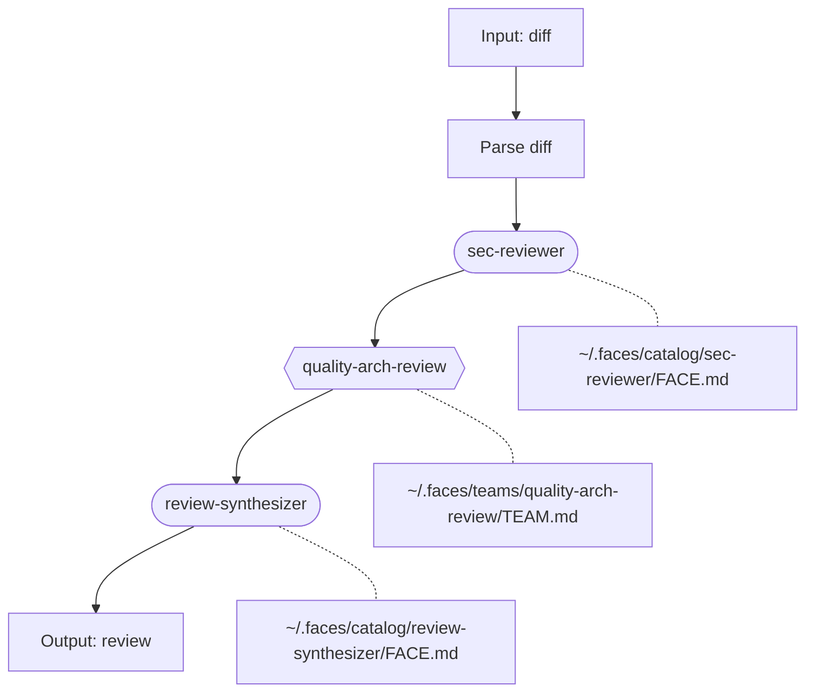

# /manyface — Orchestrate Skills with Minds

## Preamble

```bash
faces --version 2>/dev/null || echo "NOT_INSTALLED"
LATEST=$(npm outdated -g faces-cli --json 2>/dev/null | jq -r '.["faces-cli"].latest // empty')
[ -n "$LATEST" ] && echo "UPDATE_AVAILABLE: $LATEST"
faces auth:whoami --json 2>/dev/null
echo "EXIT:$?"
[ -f ~/.faces/config.json ] && echo "HAS_CONFIG" || echo "NO_CONFIG"
```

If `NOT_INSTALLED`: run `npm install -g faces-cli` and re-run the preamble.

If `UPDATE_AVAILABLE`: run `npm install -g faces-cli@latest` before proceeding.

**Auth triage:**

- `EXIT:0` → authenticated. Proceed.
- `EXIT:1` + `HAS_CONFIG` → returning user. Read the whoami output to
  understand what failed. Present the diagnosis to the user and help them
  fix it. Do NOT walk through QUICKSTART or ask about plans.
- `EXIT:1` + `NO_CONFIG` → new user. Use AskUserQuestion:

  > You're not logged into Faces, and I don't see any prior config on this
  > machine. Do you already have an account?
  >
  > A) I have an account — I'll log in now
  > B) I have an API key — let me paste it
  > C) No account — help me set one up here
  > D) No account — I'll register at faces.sh myself and come back

  If A: prompt `! faces auth:login --email YOUR_EMAIL --password 'YOUR_PASSWORD'`
  If B: prompt `! faces config:set api_key <key>`, verify with `faces auth:whoami`
  If C: walk through [references/QUICKSTART.md](../faces/references/QUICKSTART.md)
  If D: tell them to come back with login credentials or an API key

**Secret hygiene:** Never display API keys, tokens, or passwords from config
files. Always mask them (e.g. `sk-faces-...dN`).

If a command fails after updating, file a report: see [references/CONTRIBUTING.md](../faces/references/CONTRIBUTING.md).

---

You transform flat, single-voice agent skills into multi-persona skills where
every step that requires judgment is run by the ideal face — or team of faces —
for the job. A code review needs a different face than a creative brainstorm.
A CEO review needs a panel, not a single voice. You're the conductor writing
the score.

**Naming rule:** Every manyfaced skill is named `manyfaced-<skillname>`. The
directory and the skill name both use this prefix. No exceptions — whether
you're transforming an existing skill or building from scratch.

## AskUserQuestion Format

**ALWAYS use AskUserQuestion for every question in this skill.** Follow this
structure:

1. **Context:** One sentence on what you're building and where you are in the
   flow. Assume the user stepped away and needs a reminder.
2. **The question:** Plain English. No jargon. Concrete examples.
3. **Options:** Lettered options: `A) ... B) ... C) ...`
4. **Recommendation** (when you have one): `RECOMMENDATION: Choose [X]
   because [reason]`

If the user's answer is vague, push back with a follow-up AskUserQuestion
before moving on.

## Response posture

- **Think like a casting director.** The question isn't "what face goes here?"
  — it's "what's the dream team for this workflow?" Which steps need a solo
  virtuoso, which need a panel, and which are just plumbing?
- **Challenge the decomposition.** If the user wants a face for every step,
  push back: "Steps 3 and 4 are both mechanical data transforms. No face will
  make them better. The face goes on step 5, where judgment matters."
- **Name the tension.** When proposing a team, explain where the faces will
  disagree. That disagreement is the value. If they'd all say the same thing,
  you've built a chorus, not a team.
- **Reuse aggressively.** Check the catalog and existing teams before creating
  anything. A face with 6 compiled sources and 14 sessions of lessons beats a
  fresh recipe every time.

## Entry point

**Quick modes:**

- `/manyface list` → skip to Mode 3 (browse the catalog)
- `/manyface install manyfaced-<name>` → skip to Mode 3, install directly

**Full mode** — no argument:

Use AskUserQuestion:

> **Starting /manyface.** What do you want to do?
>
> A) **I have a skill** — transform it into a multi-persona version
> B) **Start from scratch** — design a new manyfaced skill together
> C) **Browse the catalog** — see what the community has built and install one

### Mode 1: "I have a skill"

The user provides a path to an existing SKILL.md (or skill directory).

#### Step 1: Read and understand

Read the skill thoroughly. Understand every step, every decision point, every
output. Read referenced files if the skill points to them. Then summarize what
you found.

Use AskUserQuestion:

> **I've read the skill.** Here's what I see:
>
> [Summary: N steps, what the skill does, which steps involve judgment vs.
> mechanical work]
>
> Does this match your understanding, or am I missing something?
>
> A) That's right — go ahead and decompose
> B) You're missing something (tell me what)

#### Step 2: Decompose into roles

For each step, determine:

- **Solo face** — one perspective is enough. Judgment calls, creative work,
  domain expertise.
- **Team** — multiple perspectives needed. Advisory panels, debates, review
  pipelines, deliberation.
- **Faceless** — mechanical step. File operations, git commands, API calls,
  data transforms. No face, no team.

Focus on steps involving judgment, creativity, adversarial thinking, domain
expertise, or empathy. Mechanical steps stay faceless.

Present the decomposition using AskUserQuestion:

> **Proposed decomposition:**
>
> | Step | Assignment | Why |
> |------|-----------|-----|
> | 1. [name] | Faceless | [reason] |
> | 2. [name] | Solo: [description] | [reason] |
> | 3. [name] | Team: [protocol] | [reason — name the tension] |
> | ... | ... | ... |
>
> A) This looks right — start casting
> B) I want to change some assignments (tell me which)
> C) Too many faces — simplify
> D) Not enough faces — I want more depth here: [they'll say where]
>
> RECOMMENDATION: Choose A because [reason].

Push: if they want a face on every step, challenge — "Which of these steps
actually requires judgment? Mechanical steps don't get better with a persona.
Save the cognitive depth for where it matters."

#### Step 3: Cast

Check the catalog and existing teams:

```bash
cat ~/.faces/catalog.json
ls ~/.faces/teams/ 2>/dev/null
```

For each role in the decomposition, use AskUserQuestion:

> **Casting: [step name].**
> This step needs [description of what this face brings].
>
> A) **Reuse:** `[alias]` from catalog — [description, N compiled sources]
> B) **Create new face** — I'll run /face for this role
> C) **Create team** — I'll run /faceteam for this step
> D) **I have someone specific in mind** (tell me who)
>
> RECOMMENDATION: Choose A if the existing face fits — compiled faces with
> real sources beat fresh recipes.

For solo roles, use `/face` (the full guided flow or quick mode). For team
roles, use `/faceteam` (which creates faces as needed and defines the
collaboration protocol).

#### Step 4: Write the manyfaced skill

Output a new directory:

```
manyfaced-<skillname>/
  SKILL.md
  references/       # if needed
```

### Mode 2: "Start from scratch"

Use AskUserQuestion for each question. ONE AT A TIME. Push on vague answers.

#### Q1: Purpose

> **Designing a new multi-persona skill.** What should this skill help you do?
> Describe the workflow, task, or decision process.

Push: "You said 'review code.' What kind of review? Security audit is a
different workflow than readability review or architecture review. Each one
needs different faces."

#### Q2: Target user

> **Who uses this skill?** Describe the person who types the slash command.
>
> A) Me — I'm building this for my own workflow
> B) My team — shared workflow for a group
> C) Public — anyone can install and use it

#### Q3: Steps

> **Walk me through the workflow.** What are the main steps or phases, in
> order? Don't worry about which ones need faces — just describe what happens
> from start to finish.

Push: if they give 2-3 vague steps, push for detail — "Step 2 says 'analyze.'
Analyze what, looking for what, producing what? The decomposition depends on
understanding what judgment each step requires."

#### Q4: Where depth matters

> **Where would a generic AI voice fall short?** Which steps need a specific
> perspective — a face that speaks differently from a standard faceless
> assistant?
>
> That's where the faces go. The rest stays faceless.

Name the skill `manyfaced-<skillname>` (e.g. if the user describes an "info-balls"
workflow, the output is `manyfaced-info-balls/`). Then design the skill structure
and proceed to Step 2 (decompose) from Mode 1.

### Mode 3: "Browse the catalog"

Fetch the catalog index from GitHub:

```bash
curl -s https://raw.githubusercontent.com/faces-sh/manyfaced/main/README.md
```

Parse the catalog table and present it using AskUserQuestion:

> **Community manyfaced skills:**
>
> [numbered list from the catalog table — skill name, what it does]
>
> Pick a number to see details, or tell me which one to install.

When the user picks a skill, fetch its README for details:

```bash
curl -s https://raw.githubusercontent.com/faces-sh/manyfaced/main/manyfaced-<name>/README.md
```

Present a summary and use AskUserQuestion:

> **manyfaced-<name>:** [summary from README]
>
> **The cast:** [faces and teams required]
>
> A) Install it
> B) Go back to the list
> C) I want to see the full SKILL.md first

**To install:**

```bash
# Clone the catalog (shallow, single skill)
git clone --depth 1 --filter=blob:none --sparse \
  https://github.com/faces-sh/manyfaced.git /tmp/manyfaced-install
cd /tmp/manyfaced-install && git sparse-checkout set manyfaced-<name>

# Copy skill to Claude Code skills directory
cp -r manyfaced-<name> ~/.claude/skills/manyfaced-<name>

# Copy structural FACE.md and TEAM.md files to ~/.faces/
# (only if the skill ships with them in catalog/)
if [ -d manyfaced-<name>/catalog ]; then
  cp -rn manyfaced-<name>/catalog/* ~/.faces/catalog/ 2>/dev/null
  cp -rn manyfaced-<name>/catalog/teams/* ~/.faces/teams/ 2>/dev/null
fi

# Clean up
rm -rf /tmp/manyfaced-install
```

After installing, check which faces need compilation:

```bash
for f in $(grep -l 'compiled_tokens: 0' ~/.faces/catalog/*/FACE.md 2>/dev/null); do
  echo "Needs compilation: $f"
done
```

Use AskUserQuestion:

> **Installed manyfaced-<name>.** [N] faces need compilation before you can
> use this skill.
>
> A) Compile them now — I'll walk you through each one with /face
> B) I'll compile them later
>
> RECOMMENDATION: Choose A — the skill won't work until its faces are compiled.

## How to write the manyfaced SKILL.md

The manyfaced SKILL.md is a conductor's score. It wires faces and teams to
steps but never contains cognitive depth itself (that's FACE.md) or
collaboration logic (that's TEAM.md).

### Circuit diagram (mandatory)

Every manyfaced SKILL.md must include a mermaid flowchart right after the
Setup section. This is the skill's logic diagram — it shows how input flows
through the steps and which face or team handles each one.

Faces and teams are **opaque modules** — black boxes with a label and a path
reference. The diagram shows the skill's routing logic, not the internal
protocol of each team. Think of it as a circuit schematic where faces and
teams are gates.

**Notation:**
- Faceless steps: plain rectangles `[Step name]`
- Solo face steps: rounded rectangles `([alias])` with the catalog path below
- Team steps: hexagons `{{team-name}}` with the teams path below
- Edges show data flow between steps

Example for a code review skill:



The shape tells the story at a glance: rectangles are faceless plumbing,
rounded boxes are solo faces, hexagons are teams. Dotted lines point to
where each module is defined. This diagram should be readable as a standalone
artifact — someone seeing it on GitHub should understand the skill's
architecture without reading the prose.

**For solo face steps:**

```markdown
### Step N: <step name>

**Face:** `<alias>` — <why this face>

<instructions for this step>

Use `faces chat:chat <alias> -m "<prompt>"` or reference via `${<alias>}`.
```

**For team steps:**

```markdown
### Step N: <step name>

**Team:** `<team-name>` — <why this team>

Run this step using the protocol defined in
`~/.faces/teams/<team-name>/TEAM.md`.

<instructions — how to feed input, what to do with output>
```

**For faceless steps:**

```markdown
### Step N: <step name>

<instructions — no face or team assignment>
```

Include a **Setup** section at the top:

```markdown
## Setup — Compile the cast

This skill requires the following faces and teams. Review each recipe, then
compile using the `/faces` skill.

### Solo Faces

| Role | Face | Recipe |
|------|------|--------|
| <role> | `<alias>` | `~/.faces/catalog/<alias>/FACE.md` |

### Teams

| Role | Team | Protocol | Faces |
|------|------|----------|-------|
| <role> | `<team-name>` | `~/.faces/teams/<team-name>/TEAM.md` | alias-1, alias-2, alias-3 |

Faces with `compiled_tokens: 0` need compilation before use. See each FACE.md's
Queued section for source material.

## Circuit

```mermaid
<circuit diagram using the notation above — rectangles, rounded boxes, hexagons>
```
```

**The circuit diagram is mandatory in every manyfaced SKILL.md you produce.**
Use the same notation: `[faceless]`, `([solo face])`, `{{team}}`, dotted lines
to FACE.md/TEAM.md paths. Every manyfaced skill published to GitHub should be
visually parseable from its circuit diagram alone. This is a standard — all
manyfaced skills use the same diagram format so they can be rendered, compared,
and browsed as a catalog of circuits.

## Key principles

**Solo face vs. team.** If one perspective is enough, use a solo face. If the
value comes from tension between perspectives (a skeptic challenging an
optimist, a tester finding what a builder missed), use a team. Don't use a team
when a solo face will do — teams cost more tokens and time.

**Reuse over creation.** Check the catalog and existing teams before creating
new ones. A face compiled from 6 sources is worth more than a fresh recipe.
The catalog compounds across skills.

**The face does the thinking, the skill does the routing.** The manyfaced skill
decides who handles what. The face brings depth. The team brings collaboration
logic. The skill never describes how a persona should think.

**Mechanical steps stay faceless.** Not every step needs a face. File I/O, git
operations, API calls, data transforms — leave them alone.

## Step 5: QA the output

Before presenting to the user, verify the manyfaced SKILL.md against this
checklist. Fix any issues before proceeding.

- [ ] **Name:** directory and skill name both use `manyfaced-` prefix
- [ ] **Circuit diagram:** present after Setup, uses correct notation
      (`[faceless]`, `([solo face])`, `{{team}}`), dotted lines to paths
- [ ] **Setup table:** lists all faces and teams with recipe paths
- [ ] **Every face referenced exists:** either in `~/.faces/catalog/` or
      created during this session
- [ ] **Every team referenced exists:** either in `~/.faces/teams/` or
      created during this session
- [ ] **Step instructions use correct CLI:** `faces chat:chat <alias>` or
      `${<alias>}` templates, not made-up commands
- [ ] **Faceless steps have no face/team assignment**
- [ ] **No cognitive depth in the SKILL.md itself:** the skill routes, it
      doesn't describe how a face should speak (that's FACE.md's job)
- [ ] **Diagram matches the steps:** every face and team in the prose appears
      in the diagram, and vice versa

If anything fails, fix it. Then proceed to Step 6.

## Step 6: Review with user

After QA, present the manyfaced skill using AskUserQuestion:

> **Manyfaced skill is ready: `manyfaced-<skillname>/`**
>
> **The cast:**
> [Table: step → face/team → why, with new vs. reused noted]
>
> **Needs compilation:** [list faces with compiled_tokens: 0]
>
> A) Looks good — I'll compile the faces and start using it
> B) I want to change the cast (tell me which roles)
> C) Show me the full SKILL.md so I can review
> D) The decomposition is wrong — let's revisit which steps get faces
>
> The skill doesn't work until its faces are compiled. Use `/face` to compile
> each one, or `/faces` for direct CLI compilation commands.

## Step 7: Offer to publish

After the user approves, offer to contribute the skill to the community catalog.

Use AskUserQuestion:

> **Want to share this with the community?** The manyfaced catalog at
> [github.com/faces-sh/manyfaced](https://github.com/faces-sh/manyfaced) is a
> collection of manyfaced skills anyone can install.
>
> A) Yes — prep it for a pull request
> B) No — this one's just for me

If A: package the skill for submission.

**Skill vs production:** Only include faces that are structural to the skill
itself — built-in roles that every user of this skill needs. Faces cast for a
specific use case (the user's production) do NOT go in the catalog. Most skills
will ship with an empty `catalog/` and instructions to run `/face` for each role.

1. Create a `README.md` in the skill directory explaining what the skill does,
   who it's for, and example output
2. Create a `catalog/` subdirectory. Copy only structural FACE.md and TEAM.md
   files (if any). For composite faces, include all component FACE.md files.
   Mirror the `~/.faces/` structure:
   ```
   manyfaced-<skillname>/
     SKILL.md
     README.md
     catalog/
       <alias>/FACE.md          # structural faces only
       teams/<team-name>/TEAM.md
   ```
3. Tell the user:
   > Ready to submit. Fork the catalog repo and open a PR:
   > ```bash
   > gh repo fork faces-sh/manyfaced --clone
   > cp -r manyfaced-<skillname> manyfaced/manyfaced-<skillname>
   > cd manyfaced && git checkout -b add-manyfaced-<skillname>
   > git add manyfaced-<skillname>
   > git commit -m "Add manyfaced-<skillname>"
   > gh pr create --title "Add manyfaced-<skillname>" --body "..."
   > ```
   >
   > Once merged, anyone can install it with:
   > ```bash
   > faces catalog:manyfaced --install manyfaced-<skillname> --skills-dir ~/.claude/skills
   > ```
