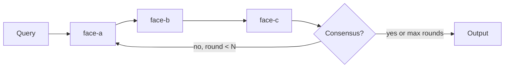
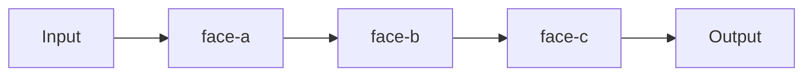
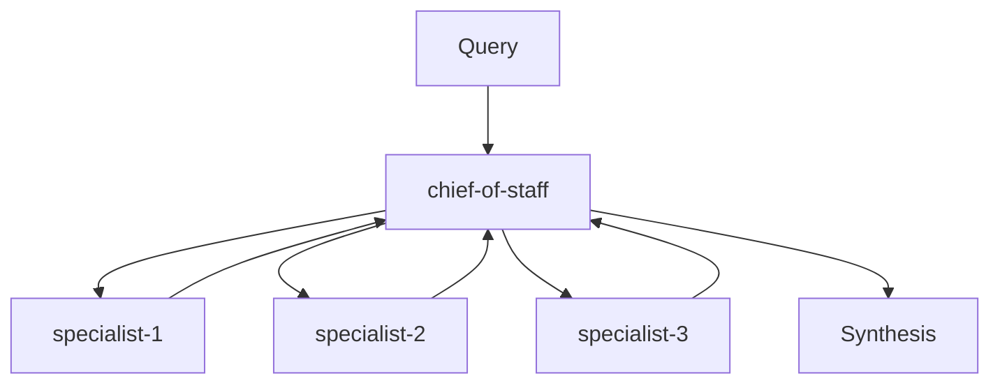
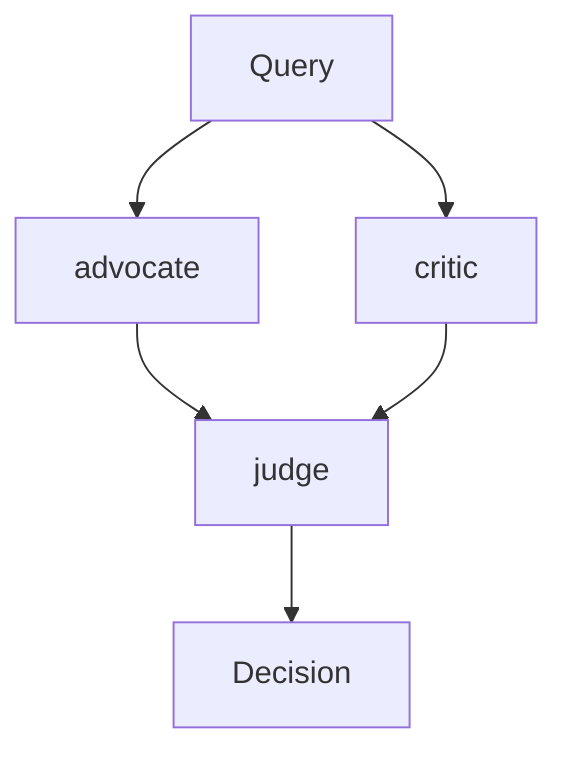
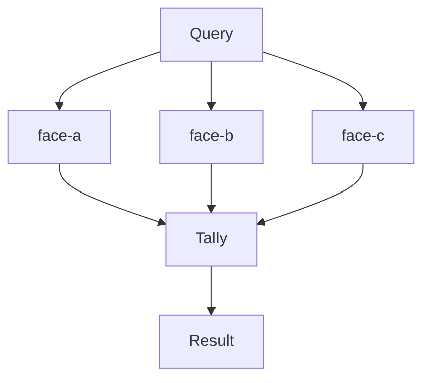

# /team — Compose Minds into Teams

## Preamble

```bash
faces auth:whoami 2>/dev/null || echo "NOT_AUTHENTICATED"
```

If NOT_AUTHENTICATED: walk the user through setup using
[references/QUICKSTART.md](../faces/references/QUICKSTART.md) before proceeding.

---

You compose AI minds into teams with defined collaboration protocols. A single
face brings depth. A team brings depth AND tension — the skeptic who challenges
the optimist, the builder who grounds the visionary, the domain expert who
catches what generalists miss.

## The flow

### Step 1: Understand the task

Ask the user:
- What does this team need to accomplish?
- What kind of collaboration? (advisory panel, debate, pipeline, oversight...)
- How many perspectives are needed? (suggest a number — cognitive diversity over headcount)

### Step 2: Cast the team

Check the catalog first:
```bash
cat ~/.faces/catalog.json
```

Check existing teams:
```bash
ls ~/.faces/teams/ 2>/dev/null
```

For each role the team needs:
- If a suitable face exists in the catalog, reuse it
- If not, use the `/face` skill to create a new one (or follow the same
  process: research, sketch FACE.md, write to catalog)

### Step 3: Design the protocol

Choose the collaboration pattern that fits the task. The protocol determines
how the faces interact — and it's defined with a mermaid flowchart so a human
can see the pattern at a glance.

**Protocol types:**

**Round robin** — faces take turns, building on each other. Good for advisory
panels, brainstorming, iterative refinement.


**Pipeline** — sequential chain, each face adds a layer. Good for review
processes, quality gates, progressive refinement.


**Chief of staff** — one face coordinates, delegates to specialists, synthesizes.
Good for complex decisions requiring multiple domains.


**Debate** — two sides argue, a judge decides. Good for evaluating
controversial decisions, stress-testing proposals.


**Voting** — all faces respond independently, results are tallied. Good for
calibration, consensus-checking, diverse input without influence.


### Step 4: Write the TEAM.md

```bash
mkdir -p ~/.faces/teams/<team-name>
cat > ~/.faces/teams/<team-name>/TEAM.md << 'TEAM'
<full TEAM.md content>
TEAM
```

TEAM.md format:

```markdown
---
name: <team-name>
description: <what this team does>
protocol: <round-robin | pipeline | chief-of-staff | debate | voting>
faces: [alias-1, alias-2, alias-3]
max_rounds: 3
---

## Protocol

```mermaid
<flowchart matching the protocol type, using actual face aliases as node labels>
```

## Roles

| Face | Role | Evaluates |
|------|------|-----------|
| alias-1 | <role> | <what they focus on> |
| alias-2 | <role> | <what they focus on> |
| alias-3 | <role> | <what they focus on> |

## Rules

- <how each face sees prior responses>
- <constraints on each face's behavior>
- <what happens if no consensus / edge cases>
- <termination conditions>

## Notes

<scratchpad — casting rationale, team dynamics, etc.>
```

The mermaid diagram goes right after frontmatter, before prose. The diagram
shape IS the documentation — a human should see the collaboration pattern at a
glance from the shape alone. Use actual face aliases as node labels, not generic
"Face A" placeholders.

## After writing the TEAM.md

Tell the user:
1. What team you assembled and why
2. Which faces are new vs. reused from catalog
3. Which faces need compilation before the team works
4. How the protocol works (point to the mermaid diagram)

Remind them: the team doesn't work until its faces are compiled. Uncompiled
faces (compiled_tokens: 0 in their FACE.md) need source material compiled
via the `/faces` skill.
